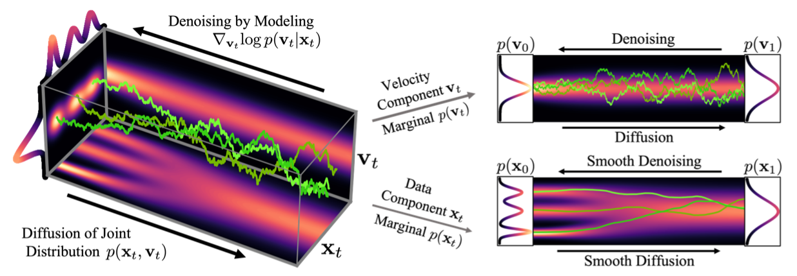
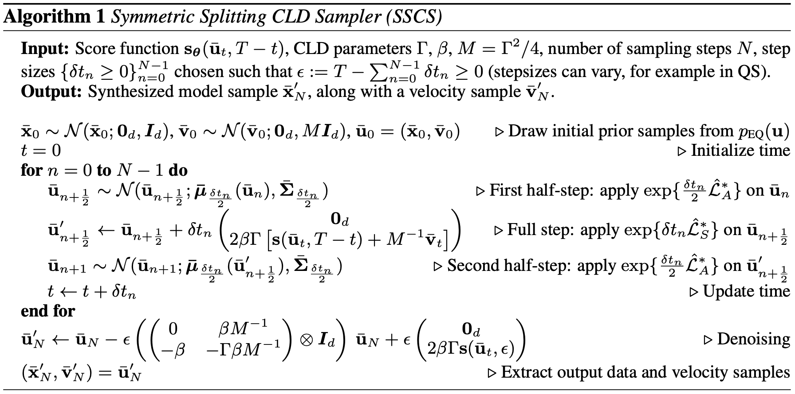
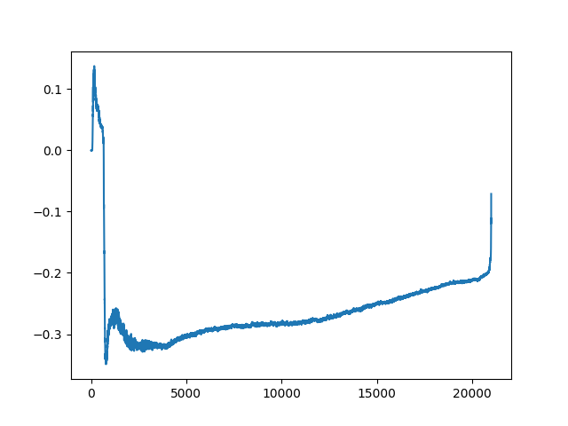
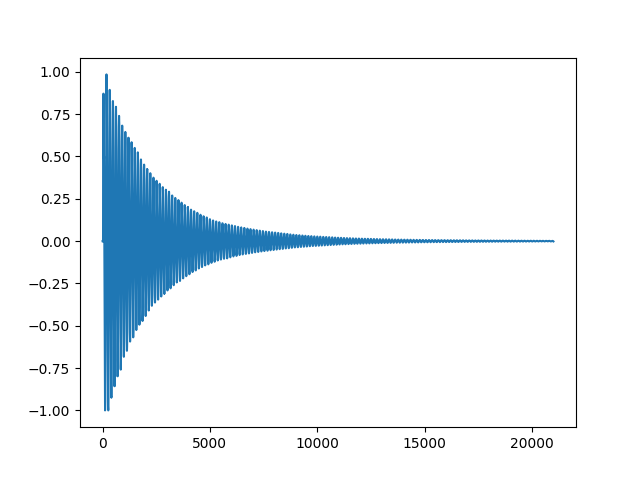
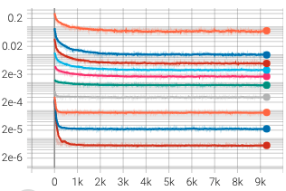

# Diffusion Models (Part 2)

These models were first introduced with the work of Song et al.~[1] in 2021. The brilliant idea lies within using an infinite number of noise scales, namely considering the time limit case of the Markovian process. In this framework, the diffusion process is indexed by a continuous-time variable \\(t \in [0, T]\\). Note that we do not rely on a fixed time schedule anymore and could choose whatever timestep to diffuse and train. Using Itô's calculus they model the diffusion process through the general stochastic differential equation:

$$    
dx = f(x,t) dt + g(t) dw
$$

where \\(w\\) is the standard Wiener process, \\(f(\cdot, t)\\) the drift coefficient of \\(x(t)\\) and \\(g(\cdot)\\) its diffusion coefficient. In the same way, there is a reverse process in discrete models, with SDEs one samples \\(x(T) \sim p_T\\) and runs the SDE backward to reach \\(x(0) \sim p_0\\), which is the posterior distribution we aim at sampling from. The reverse-time SDE is given by:

$$
    dx = [f(x,t) - g(t)^2 \nabla_x \ \text{log} \ p_t(x)]dt + g(t) d\bar{w}
$$

with \\(\bar{w}\\) is a Wiener process running backwards, \\(p_t(x)\\) is the probability density of \\(x_t\\). We only need to know \\(\nabla_x \ \text{log} \ p_t(x)\\) to be able to reverse the process. Song et al.~[1] propose score matching [2]: train a time-dependant score-based model \\(s_\theta(x,t)\\) via: 

$$
    \theta^* = \text{arg min}_{\theta} \ \mathbb{E}_t \{ \ \lambda(t) \mathbb{E}_{x(0)} \mathbb{E}_{x(t) \mid x(0)}\left[  \left\lVert s_\theta(x,t) - \nabla_{x(t)} \ \text{log} \ p_{0t}(x(t) \mid x(0)) \right\rVert_2^2  \right] \}
$$

such that \\(s_\theta^*(x,t) = \nabla_x \ \text{log} \ p_t(x)\\).

Also, much like it was appreciable that we could diffuse at an arbitrary time step in discrete models, the same goes for continuous models. This is where the design of SDEs becomes important. When $f(\cdot, t)$ is affine, the transition kernel $p_{0t}(x(t) \bar x(0))$ from $0$ to $t$ is Gaussian, with a usually closed-form formula for the mean and the variance. This lets us diffuse at any time step without requiring us to go through an intermediary step. 

## Variance Exploding , Variance Preserving SDES

Song et al.~[1] propose two different SDEs, that can be derived in the limit of \\(N \rightarrow \infty\\)
in the discrete timestep schedule of SMLD (Song et al.~[3] and DDPM (Ho et al.~[4]).

$$
    dx = \sqrt{\frac{d\left[\sigma^2(t)\right]}{dt}} dw
$$

$$
    dx = -\frac{1}{2}\ \beta(t) x dt + \sqrt{\beta(t)} dw
$$

The first one is commonly referred to as VE SDE, which stands for Variance Exploding because when \\(t \rightarrow \infty\\) the process has an exploding variance and the second one is called Variance Preserving because it yields a fixed variance process (equal to one when the posterior distribution has unit variance). The associated work on ODEs that is accessible in their paper and left aside here. 

The respective perturbation kernels are the following:
$$
    p_{0t}( x(t) \mid x(0)) = \left\{
    \begin{array}{ll}
        \mathcal{N}(x(t); x(0), \left[\sigma^2(t) - \sigma^2(0)\right]\mathbf{I}) \ \ \ \text{(VE SDE)} \\
        \mathcal{N}(x(t); x(0)e^{-\frac{1}{2}\int_0^t \beta(s)ds}, (1 - e^{-\int_0^t \beta(s)ds})\mathbf{I}) \ \ \text{(VP)}
    \end{array}
\right.
$$

At training time, one can sample batch_size different time elements \\(t \sim \mathcal{U}([0, T])\\) and diffuse each element of the batch accordingly without worrying about the fixed time steps. With enough training steps, there will be full coverage of the set \\([0, T]\\), which ensures we can get through the backward process through any time schedule. It also opens the possibility to find optimized time discretization. 

## Critically-Damped Langevin Diffusion

At the end of 2021, Dockhorn et al.~[5] proposed a fairly elegant approach to SGMs, based on statistical mechanics. Their whole idea is to add a second variable that's coupled to the data \\(x\\). Much like there is a momentum to a position in physics, authors add \\(v\\) to \\(x\\). This augmented diffusion process is supposed to be much more smooth as the noise is gradually injected not in \\(x\\) but in \\(v\\). Since variables are coupled, $x$ has also noise that's injected but in a smoother way. The work proposes a very convenient way to display that idea in the following figure. In the following, \\(u_t = (x_t, v_t)\\).

The CLD name comes from the fact that \\(\Gamma^2 - 4 M = 0\\) in the underlying CLD SDE. You will probably recognize the famous \\(b^2 - 4ac\\) which, depending on the sign, indicates the behavior of the solution of a differential equation. The same goes here, authors deliberately choose coefficients that verify the previous null equality. Intuitively, that is because it corresponds to a convergence (to our target distribution) that occurs both quickly and in a smooth manner without oscillations.

The new SDE becomes: 

$$
    \small
    \begin{pmatrix}
        dx_t \\
        dv_t \\
    \end{pmatrix} =
    \begin{pmatrix}
        M^{-1} v_t \\
        -x_t \\
    \end{pmatrix}
    \beta dt + 
    \begin{pmatrix}
        \mathbf{0}_d \\
        -\Gamma M^{-1}v_t \\
    \end{pmatrix}
    \beta dt
    +
    \begin{pmatrix}
        0 \\
        \sqrt{2 \Gamma \beta} \\
    \end{pmatrix}
    dw_t
$$  

where \\(d\\) is the dimension of both \\(x\\) and \\(v\\), \\(M \in \mathbb{R}^+\\) is the hyperparameter that couples \\(x\\) and \\(v\\), along with the friction coefficient \\(\Gamma\\) that sets the strength of the noise injection. \\(\beta\\) is analogous to the \\(\beta(t)\\) in other SDEs. Authors show that the equilibrium distribution for the CLD equation is \\(p_{eq}(x_T, v_T) = \mathcal{N}(x_T; \mathbf{0}_d, \mathbf{I}_d)\mathcal{N}(v_T; \mathbf{0}_d, M\mathbf{I}_d)\\).

In terms of objective function, Dickhorn et al.[5] choose to initialize the joint distribution the following way: \\(p_{eq}(x_T, v_T) = p_{data}(x_0)\mathcal{N}(v_0; \mathbf{0}_d, \gamma M\mathbf{I}_d)\\). We found this \\(\gamma\\) (\\(< 1\\) ) parameter to have indiscernible effect in practice. They also derive a novel, tailored score matching objective.
$$\small
    \text{min}_{\theta} \mathbb{E}_{t\sim\mathcal{U}([0,T])}\mathbb{E}_{u_t\sim p_t(u_t)} \left[ 
    \left\lVert
    s_\theta(u_t, t) - \nabla_{v_t} \ log \ p_t(v_t \mid x_t)
    \right\rVert^2_2
    \right]
$$

In practice this objective is not usable since \\(p_t(v_t \mid x_t)\\) is not known. This is the reason why they come up with a specifically tailored trainable objective which they call Hybrid Score Matching (HSM). The trick is to draw samples form \\(p_{data}(x_0)\\) while "marginalizing over the full initial velocity distribution" \\(p_0{v_0}\\). You can find a lot more details in the appendix of their paper. This now means we can train on \\(p(u_t \mid x_0)\\) which is Normal and tractable. Finally, the work parametrizes the score model to predict noise rather than the score itself, as in DDPM for instance.

Let's write \\( u_t = \mathbf{\mu}_t(x_0) +\\) \\(\mathbf{L}_ \epsilon_{2d}\\), with \\(\Sigma_t = \mathbf{L}_t\mathbf{L}_t^\top\\) is the Cholesky decomposition of \\(p_t(u_t \mid x_0)\\)'s covariance matrix, \\(\epsilon_{2d} \sim \mathcal{N}(\mathbf{0}_ {2d}, \mathbf{I}_{2d})\\), and \\(\mu_t(x_0)\\) is the mean of \\(p_t(u_t \mid x_0)\\). The annex B of the paper gives closed-form solutions to all these variables. Noting 
\\(\Sigma_t = \big(\begin{smallmatrix}
  \Sigma_t^{xx} & \Sigma_t^{xv}\\
  \Sigma_t^{xv} & \Sigma_t^{vv}
\end{smallmatrix}\big)\\), we define \\(l_t = \sqrt{\frac{\Sigma_t^{xx}}{\Sigma_t^{xx}\Sigma_t^{vv} - (\Sigma_t^{xv})^2}}\\), we get \\(\nabla_{v_t} \text{log} \ p_t (u_t \mid x_0) = -l_t \epsilon_{d:2d}\\). Additionally, since the marginal is not Normal at all times authors assume they can parametrize it with a Normal score corrected with a residual term. 
Finally, they propose:

$$
    \begin{split}
    s_\theta(u_t, t) =& -l_t \alpha_\theta(u_t, t) \\
                     =& -l_t ( l_t^{-1} v_t / \Sigma_t^{vv} + \alpha_\theta'(u_t, t))
    \end{split}
$$

with \\(\alpha'\\) being the corrective residual term. With that in our hands, the training objective becomes:

$$
    \text{min}_{\theta} \ \mathbb{E}_{t\sim\mathcal{U}([0,T])}\mathbb{E}_{u_0\sim p_0(x_0)} \mathbb{E}_{\epsilon_{2d}\sim \mathcal{N}(0_{2d}, \mathbf{I}_{2d})}[
    \lambda(t)l_t^2 \left\lVert
    \epsilon_{d:2d} - \alpha_\theta(\mathbf{\mu}_t(x_0) + \mathbf{L}_t \epsilon_{2d}, t) 
    \right\rVert^2_2
    ]
$$

The choice of \\(\lambda(t)\\) can make the objective match maximum likelihood learning (\\(\lambda(t) = \Gamma\beta\\)) or improve high quality sampling (\\(\lambda(t) = l_t^{-2}\\) ). For audio generation, it was found that both techniques produce similar samples, indistinguishable from one another to the human ear. \\

For sampling, Dickhorn et al. come up with a specifically tailored scheme too: Symmetric Splitting CLD Sampler (SSCS). 

$$
\small
    \begin{split}
    \begin{pmatrix}
        d\bar{x}_t \\
        d\bar{v}_t \\
    \end{pmatrix} &=
    \begin{pmatrix}
        -M^{-1} \bar{v}_t \\
        \bar{x}_t \\
    \end{pmatrix}
    \beta dt
    +
    \begin{pmatrix}
        \mathbf{0}_d \\
        2\Gamma[s(\bar{u}_t, T-t) + M^{-1}\bar{v}_t]\\
    \end{pmatrix}
    \beta dt
    +
    \begin{pmatrix}
        \mathbf{0}_d \\
        -\Gamma M^{-1}\bar{v}_t \\
    \end{pmatrix}
    \beta dt +
    \begin{pmatrix}
        0 \\
        \sqrt{2 \Gamma \beta} \\
    \end{pmatrix}
    dw_t
    \end{split}
$$

The last two terms are considered together and form an Ornstein-Uhlenbeck process that can be solved analytically. The first one corresponds to a Hamiltonian component and the second to the score model term. While this is frankly very elegant mathematics there will be no details regarding the way the sampling scheme has been designed. If you are interested, Molecular Dynamics~[6] is an excellent work. The key point stems from using the symmetric Trotter theorem as well as the Baker–Campbell–Hausdorff formula. Again, they give thorough details in annex D. You can find the whole procedure in the followinf-g figure. They basically did a \\(A-B-A\\) pattern, which we have tried splitting even more further with \\(A-B-B-A\\), \\(B-A-B\\), etc, which did not yield better results. The reason for that is that although it is supposed to be much more precise due to smaller steps (\\(\delta t/4\\) for instance) it accumulates much more (smaller) errors which amount to the same as SSCS does.

There was also an issue that was encountered with the corrective \\(\epsilon\\) added for computational stability purposes in the Cholesky decomposition. Even though the authors add a denoising step, we found by experience that the sampler does not sample from the posterior distribution but from the posterior distribution \\(+ \sqrt{\epsilon}\\). It does not change a thing for image generation, at \\(\epsilon = 1e-9\\) the added noise is not perceivable to the human eye. However, for audio generation, the noise is perceptible which obligates to lower \\(\epsilon\\). We found \\(\epsilon = 1e-12\\) to work.

Finally, even though this method is elegant (with an extremely/impressive qualitative paper), it is rather impractical because too specific. One can hardly tweak it. We lose access to the gradient of $x$ itself for instance. It renders many other techniques unfeasible such as the CRASH re-parametrization (Rouard and Hadjeres~[7]). We have tried adding a second term in the loss objective, including the noise \\(\epsilon_{0:d}\\) but it was without particular success.
The objective resembled the following: \\(l_{xx}^2 \left\lVert \epsilon_{0:d} - \alpha_\theta^x \right\rVert + l_{vv}^2 \left\lVert \epsilon_{d:2d} - \alpha_\theta^v \right\rVert\\). One might also add a cross-term with \\(l_{xv}^2\\). 

### Results

We tried training with HSM on two different internal datasets, one of drum sounds and one of synthesizer sounds. They are respectively composed of approximately 300.000 kick, snare, cymbal (in equal proportions), and 500.000 synthesizer sounds. The samples have a sample rate of \\(44.1\\)KHz and are recorded in mono. The audio was restricted to 21.000 timesteps because most sounds last less than 0.5 seconds. At this point, it has become abundantly clear that training on data $x \in \mathbb{R}^{21000}$ is too hard, without any access to real computation abilities. Therefore, techniques such as cascading (in the next article) feel required. Also, all generation is pre-processed using a Mu-law, and noise is embedded with Random Fourier Features in the U-net.

For conditioning-free sampling, the generated sounds were rather good for drums while the synthesizer ones were mitigated: at least one sound in each batch was not acceptable such as in the following figure. Besides those inexplicable samples, synthesizer sounds were good but not very diverse. It usually boiled down to 4-5 different categories with small variations. Since a model yields a different quality of results for two different datasets, diffusion models may be dataset dependent. Also, the results for conditioned samples were impressive although still imperfect. We were able to generate a coherent bass line for a soundtrack, which the UNet was conditioned on. Generation samples are a few seconds long and still contain a bit of background noise.

## References

[1] Y. Song, J. Sohl-Dickstein, D. P. Kingma, A. Kumar,
S. Ermon, and B. Poole, “Score-based generative
modeling through stochastic differential equations,”
CoRR, vol. abs/2011.13456, 2020. [Online]. Available:
https://arxiv.org/abs/2011.13456

[2] A. Hyvärinen, “Estimation of non-normalized
statistical models by score matching,” Journal of
Machine Learning Research, 2005.

[3] Y. Song and S. Ermon, “Generative modeling
by estimating gradients of the data distribution,”
CoRR, vol. abs/1907.05600, 2019. [Online]. Available:
http://arxiv.org/abs/1907.05600

[4] J. Ho, A. Jain, and P. Abbeel, “Denoising diffusion
probabilistic models,” CoRR, vol. abs/2006.11239,
2020. [Online]. Available: https://arxiv.org/abs/2006.
11239

[5] T. Dockhorn, A. Vahdat, and K. Kreis, “Score-
based generative modeling with critically-damped
langevin diffusion,” 2021. [Online]. Available: https:
//arxiv.org/abs/2112.07068

[6] C. M. Benedict Leimkuhler, “Molecular
dynamics: With deterministic and stochas-
tic numerical methods.” 2015. [Online].
Available: https://link.springer.com/book/10.1007/
978-3-319-16375-8://arxiv.org/abs/2205.11487

[7] S. Rouard and G. Hadjeres, “CRASH: raw audio
score-based generative modeling for controllable
high-resolution drum sound synthesis,” CoRR, vol.
abs/2106.07431, 2021. [Online]. Available: https:
//arxiv.org/abs/2106.07431

