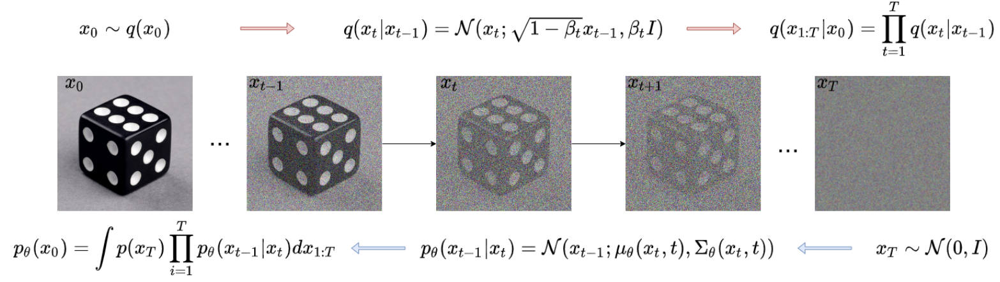
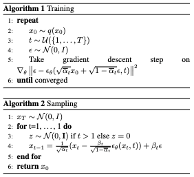

# Diffusion Models (Part 1)

The craze for diffusion models started in 2019 and since then, the impressive results of such models drew the attention of the ML research community. As of today, an ever increasing amount of teams are conducting active research and publishing in the field. This series of articles is an attempt at summarizing the major contributions, their general ideas, the common architectures along with discussing their computational limitations. I could not possibly cover all papers that have been published so far, and that many work that has not been included here deserve full consideration too. This document is for educational purposes, and aims to be an introductory work for any one willing to enter the field. There would be a lot more to say about each contributions but I tried to keep a general approach.

Sohl-Dickstein et al. (2015) [1] introduced diffusion probabilistic models, a class of generative models which match a data distribution by learning to reverse a multi-step noising process. It was then followed by a myriad of variations, improvements and evolution (Song et al., Dhariwal et al. [3], Song et al. [4]) which lead to impressive results (Ramesh et al. [5], Saharia et al. [6]). The whole purpose is to draw fresh new samples from a distribution that cannot easily be tracked.  Instinctively, the process boils down to two steps. First, the forward process (training time), which consists in adding gradual noise to the intangible distribution to turn it into a known-one (typically gaussian), from which we can sample from. While doing so, a neural networks attempts to learn the "path" the prior distribution has followed to reach the posterior. The second step is the backward process, referred to as inference. It consists in sampling from the known distribution and going back up the previously learned "path" until we reach the intangible distribution. Therefore we end up with a new sampled point. Comparatively with GANs, diffusion models avoid collapse mode (Metz et al. [7]) and offer more diversity of generated samples. Moreover, they seem to be usually more easily trainable because they require less hyperparameters, are more stable. However, a major drawback remains the inference time that usually requires hundreds up to thousands forward passes in a neural network, which make inference too long.

## Discrete Diffusion Models 

In the diffusion process, discrete models require fixing a time schedule $0, \cdots, T$ prior to the training. Data is diffused exactly at these timesteps. It means there are $T$ latent variables $\mathbf{x_0}, \dots, \mathbf{x_T}$. Noise is gradually added at those time steps and only those: therefore forward and reverse process only go through these time steps as seen in the following figure. 

The length $T$ of the forward process is a very important hyper parameter. The more steps there are the more precise the process is, with fewer errors made/accumulated at each time steps. On the opposite, it also implies more time to generate samples. There is a trade-off here.

### DDPM: Denoising Diffusion Probabilistic Models

Ho et al. [8] introduce DDPM. Given samples, the model starts from a data distribution $q(x_0)$ and learns a distribution $p_{\theta}(x_0)$ that approximates $q(x_0)$ and is easy to sample from. For DDPM, the forward process is defined as a Markov chain that adds Gaussian noise to the data, according to a time schedule $\beta_1, \dots, \beta_T$:

$$
  \begin{split}
  q(x_{1:T} | x_0 ) =& \prod_{t=1}^T q(x_t | x_{t-1}), \  
  \\ \text{with} \ \ 
  q(x_t | x_{t-1}):=& \ \mathcal{N}(x_t \ ; \ \sqrt{1 - \beta_t} x_{t-1}, \beta_t \mathbf{I})
  \end{split}
$$

Instead of having to diffuse step by step to reach an arbitrary time, which is heavy, there is a powerful property of the DDPM Markov chain that can be leveraged: (using the notation \\(\alpha_t:= 1 - \beta_t, \ \overline{\alpha}_t = \prod_{s=1}^t \alpha_s \\) ), $q(x_t | x_0) = \mathcal{N}(x_t \ ; \ \sqrt{\overline{\alpha}_t} x_0, (1 - \overline{\alpha}_t)\mathbf{I})$. This renders the forward process fairly easy as it allows to diffuse at any timestep $t$ in closed form.  For the reverse process, DDPM looks for a distribution that is as close as possible to the posterior $q$. The latent variables take the following form: 

$$
\begin{split}
  p_{\theta}(x_0) &= \int p_{\theta}(x_{0:T}) dx_{0:T} \  
  \text{where}  \\
  p_{\theta}(x_{0:T})&:= p_{\theta}(x_{T}) \prod_{t=1}^T p_{\theta}(x_{t-1} | x_t) 
  \end{split}
$$

With the parametrization: 
$$
p_{\theta}(x_{t-1} | x_t) = 
  \mathcal{N}( x_t ; \mathbf{\mu}_\theta(x_t, t), \mathbf{\Sigma}_\theta(x_t, t))
$$

Since this is a parametric model, it is natural to look to compute the exact marginal likelihood and maximize it. However, since the exact likelihood is not tractable, we'll content ourselves with approaching it using variational approximation. This means we should try looking for a distribution that is as close as possible to the true posterior. In practice this means maximizing the Evidence Lower Bound (ELBO). But as it turns out,  this is equivalent to minimizing a KL divergence as the ELBO can be re written as a sum of KL terms at between each time steps in this case:

$$
\text{ELBO} = \mathbb{E}_q[D_{KL}(q(x_T | x_0) \ || \ p(x_T)) + \sum_{t > 1} D_{KL}(q(x_{t-1} | x_t, x_0) \ || \ p_\theta(x_{t-1} | x_t)) - \text{log}(p_\theta(x_0 | x_1))].
$$

As for $\mathbf{\mu}_\theta(x_t, t)$ and $\mathbf{\Sigma}_\theta(x_t, t)$, they have been left out until now. Ho et al.\~cite{DDPM} propose to fix $\mathbf{\Sigma}_\theta(x_t, t) = \beta_t \mathbf{I}$ (Fore more details, Bao et al. [9]propose an analytic solution of the real estimate). Regarding $\mathbf{\mu}_\theta$, authors use the fact that there exists a closed form for the posterior conditioned on $x_0$:  $q(x_{t-1} | x_t, x_0) = \mathcal{N}(x_{t-1}; \mathbf{\tilde{\mu}}_t(x_t, x_0), \tilde{\beta}_t \mathbf{I})$. They then inject it into the time-corresponding KL term of the ELBO equation and which leads to: 

$$
\mathbf{\mu}_\theta(x_t, t) = \frac{1}{\sqrt{\alpha_t}} ( x_t - \frac{\beta_t}{\sqrt{1 - \overline{\alpha}_t}} \mathbf{\epsilon}_\theta(x_t, t))
$$

with $x_t = \sqrt{\overline{\alpha}_t} x_0 + \sqrt{1 - \overline{\alpha}_t} \epsilon, \ \ \epsilon \sim \mathcal{N}(0, \mathbf{I})$ . This means that learning the latent variables boils down to learning the noise that's been added at each time step. Finally, Ho et al. sum up the process with the following algorithms:

### DDIM: Denoising Diffusion Implicit Models

The work of Song et al. aims at reducing the number of iterations required by the generative models. Authors start from DDPM and observe that its objective only relies on $q(x_t | x_0)$ but not on the terms $q(x_{1:T} | x_0)$. Since it is possible from a set of marginals to produce different joint distributions, DDIM investigates non-Markovian inference process with the same objective function as DDPM.To do so, the work considers the following distributions, $\sigma$ being a real positive $T$-dimensional vector: 

$$
\begin{split}
  q_{\sigma}(x_{1:T} | x_0 ):= q_{\sigma}(x_T | x_0 ) \prod_{t=1}^T q_{\sigma}(x_{t-1} | x_t, x_0 )
  \end{split}
$$

$$
\begin{split}
  \text{where}
  \left\{
    \begin{array}{ll}
        q_{\sigma}(x_{T} | x_0) = \mathcal{N}(\sqrt{\alpha_T} x_0, (1 - \alpha_T)\mathbf{I}) & \\
        q_{\sigma}(x_{t-1} | x_t, x_0 ) = \mathcal{N}(m(x_0, x_t), \sigma_t^2 \mathbf{I}) &\\
        m(x_0,x_t) =  \sqrt{1 - \alpha_{t-1} - \sigma_t^2} \frac{x_t - \sqrt{\alpha_t} x_0}{\sqrt{1 - \alpha_{t-1}}} +\sqrt{\alpha_{t-1}} x_0&
    \end{array}
\right.
  \end{split}
$$

The complex mean $m(x_0, x_t)$ is to ensure that $q_\sigma(x_t | x_0) \sim \mathcal{N}(\sqrt{\alpha_t} x_0, (1 - \alpha_t)\mathbf{I})$, same as in DDPM. Notice that the process is not Markovian anymore as knowing $x_t$ relies on knowing both $x_{t-1}$ and $x_0$. 

For DDPM, we mentioned we were looking for a distribution that is trainable. Same goes for DDIM, they define $p_\theta( x_{t-1} | x_t)$. The key idea is to leverage tractability of $q_{\sigma}(x_{t-1} | x_t, x_0 )$. To do so requires knowledge of $x_t$ (direct access since it is an observed variable) and $x_0$. Now the trick is to rewrite $x_t = \sqrt{\overline{\alpha}_t} x_0 + \sqrt{1 - \overline{\alpha}_t} \epsilon$ to get an estimate of denoised observation: 

$$f_\theta^{(t)}(x_t):= (x_t - \sqrt{1 - \alpha_t} \epsilon_\theta^{(t)} (x_t)) / \sqrt{\alpha_t}$$

Therefore, we have: 

$$p_\theta( x_{t-1} | x_t) = 
    \left\{
    \begin{array}{ll}
        \mathcal{N}(f_\theta^{(1)}(x_1), \sigma_1^2\mathbf{I}) \ \text{if} \ t=1  & \\
        q_{\sigma}(x_{t-1} | x_t, f_\theta^{(t)}(x_t) ) &
    \end{array}
\right.
$$

The rest is similar to DDPM with the same training steps but a different sampling formula. Two things worth noticing is that first DDIM becomes a DDPM model using $\sigma_t = \sqrt{(1 - \alpha_{t-1}) / (1 - \alpha_t)} \sqrt{1 - \alpha_t / \alpha_{t-1}}$. Second, setting $\forall t, \sigma_t = 0 $ renders the process completely deterministic. Samples are generated with a fixed procedure. This is that particular case than Song et al. name \textit{Denoising Diffusion Implicit Model}.

Authors also offer an accelerated generation process along with a correspondence with Neural ODEs that I leave aside in this work. 

## Conclusion

In this first article, I presented the two major Markov-chain based diffusion models, upon which rely many other papers. They providean excellent general framework/backbone to build a tailored generative model (such as DALLE•2 and Imagen have proven to).

## References

[1] J. Sohl-Dickstein, E. A. Weiss, N. Maheswaranathan,
and S. Ganguli, “Deep unsupervised learning using
nonequilibrium thermodynamics,” 2015. [Online].
Available: https://arxiv.org/abs/1503.03585

[2] Y. Song and S. Ermon, “Generative modeling
by estimating gradients of the data distribution,”
CoRR, vol. abs/1907.05600, 2019. [Online]. Available:
http://arxiv.org/abs/1907.05600

[3] A. Nichol and P. Dhariwal, “Improved denoising
diffusion probabilistic models,” CoRR, vol.
abs/2102.09672, 2021. [Online]. Available: https:
//arxiv.org/abs/2102.09672

[4] J. Song, C. Meng, and S. Ermon, “Denoising diffusion
implicit models,” CoRR, vol. abs/2010.02502, 2020.
[Online]. Available: https://arxiv.org/abs/2010.02502

[5] A. Ramesh, P. Dhariwal, A. Nichol, C. Chu,
and M. Chen, “Hierarchical text-conditional image
generation with clip latents,” 2022. [Online].
Available: https://arxiv.org/abs/2204.06125

[6] C. Saharia, W. Chan, S. Saxena, L. Li, J. Whang,
E. Denton, S. K. S. Ghasemipour, B. K. Ayan, S. S.
Mahdavi, R. G. Lopes, T. Salimans, J. Ho, D. J.
Fleet, and M. Norouzi, “Photorealistic text-to-image
diffusion models with deep language understanding,”
2022. [Online]. Available: https://arxiv.org/abs/2205.
11487

[7] L. Metz, B. Poole, D. Pfau, and J. Sohl-Dickstein,
“Unrolled generative adversarial networks,” 2016.
[Online]. Available: https://arxiv.org/abs/1611.02163

[8] J. Ho, A. Jain, and P. Abbeel, “Denoising diffusion
probabilistic models,” CoRR, vol. abs/2006.11239,
8
