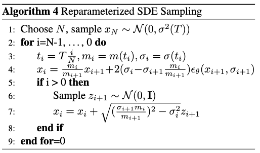
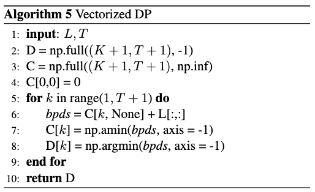
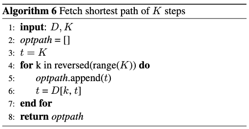
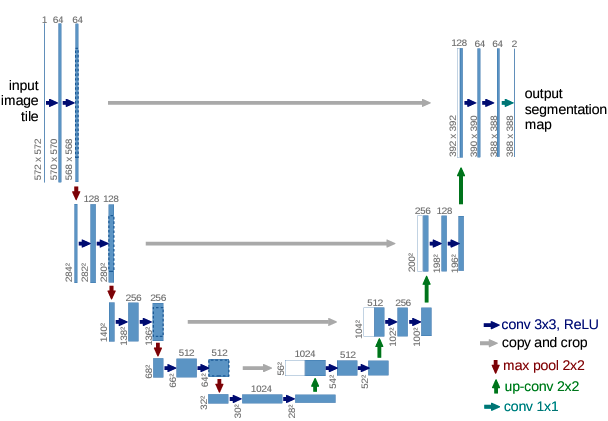
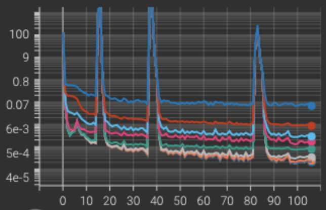
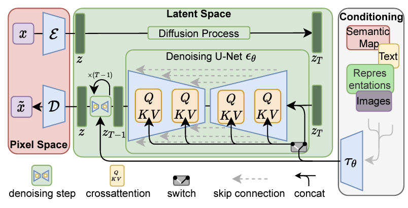
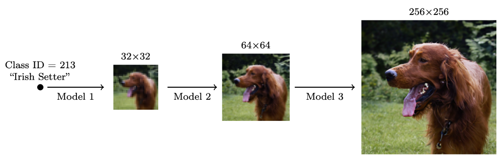

# Diffusion Models (Part 3)

In this article, I present several techniques to improve the reverse process, the fundamental UNet architecture along with miscellaneous other techniques. 

## Reverse process

The major issue with SGMs happens at inference time. The "simplest" inference schemes such as Euler-Maruyama make approximation mistakes that are inherent to their discretization process and thus require a lot of steps to reduce the accumulated error at each step. This has usually meant hundreds up to thousands of steps which implies a lot of forward passes in the network. This renders the whole inference process very slow in practice. Now, to solve this we need to find a smarter design for sampling schemes. Some such as the one stated as a theorem from Popov et al.~[1] also try reaching better sampling quality without increasing sampling steps. One question that was raised was to what extent are those inference schemes re-usable for other tasks than the one it was designed for? Also, there have been many papers tackling this subject but this summary only mentions a few. This is either because they provide a great general framework in light of the latter question or because they appeared to work pretty well for audio generation in waveform.

### Gotta Go Fast

Jolicoeur et al.~[2] use stochastic Improved Euler's method and introduce a \textit{tolerance} term to reach an advantageous method in terms of "quality/diversity for high-resolution images, along with 2 to 3× speedups". At each step, the solver attempts two different methods, one of lower order and one of higher order. Comparing both allows choosing the next step size dynamically. Depending on the result of a scaled error between the higher and lower order prediction they choose a different step size for the reverse process. Therefore steps size might change at each size. This algorithm only requires two score function evaluations which means it's twice as expensive as a usual EM integration method. However, this is balanced by the possibility of doing greater steps which reduces inference time.

### CRASH

In their work, Rouard and Hadjeres~[3] propose a reparametrization of SDEs along with the associated ODE one. The two aspects that need to be to point out in this work are first that their reparametrization of ODEs yields the same sampling scheme as DDIM, therefore linking both. Second, the SDE re-parametrization permits to generation of great samples faster than real-time, in so little as 20 steps. Consider an SDE that has the following perturbation kernel: 

$$
p_t(x(t) \mid x(0)) = \mathcal{N}(x(t); m(t)x(0), \sigma^2(t)\mathbf{I})
$$

with \\(m(t)\\) and \\(\sigma(t)\\) following the system:

$$
\left\{
    \begin{array}{ll}
        \frac{dm}{dt} = f(t) m(t) & \\
        \frac{d\sigma^2}{dt}(t) = 2 f(t)\sigma^2(t) + g^2(t) &
    \end{array}
\right.
$$

For such SDEs, it is possible to write it such that the reverse SDE take the following form:

$$
d\left(\frac{x}{m}\right) = 2 \frac{d}{dt}\left(\frac{\sigma}{m}\right)\epsilon(x, \sigma) dt + \sqrt{\frac{d}{dt}\left(\frac{\sigma^2}{m^2}\right)}dw  
$$

Therefore, the only approximation error is due to the integration of the first term of the last equation, which approximates \\(\epsilon(x(t), \sigma(t)) \approx \epsilon(x_{i+1}, \sigma_{i+1})\\).

This applies typically for VE, VP, and sub-VP SDEs but, as mentioned before, does not for CLD.

### Dynamic programming

Another general framework used that can even be added on top of other sampling techniques is dynamic programming (Watson et al.~[4]). The purpose is, given a trained model, to optimize the timesteps chosen. In the DDPM section of the first article, it has been said that the objective can be seen as a sum of KL terms, that are functions of the \\( (t_i, t_{i'})\\). Here \\(L(t, s)\\) is the the cost of transition from \\(t\\) to \\(s\\), essentially the related KL term in the ELBO objective. Visualizing the optimization with DP the question becomes: Given a fixed budget of \\(K\\) steps, what is the subset \\( \{t_0', \cdots, t_K'\} \subset \{t_0, \cdots, t_N\} \\) that has the best ELBO path?
Either \\( \{t_0, \cdots, t_N\} \\) is fixed in models such as DDPM or DDIM or can be arbitrary for continuous models. Since the training is decoupled from inference this method can be applied to any pre-trained diffusion model.

Solving this dynamic programming problem essentially boils down to a modified version of Dijkstra's algorithm. Indeed, the problem is a least-cost path problem, only with an added constraint. The search only goes as far as \\(K+1 \\) nodes with fixed starting and ending nodes. If nothing is done, the algorithm is in \\(\mathcal{O}(T^2) \\). But Watson et al.~[4] nicely notice that a single forward pass can compute all the \\(L(t, \cdot) \\) terms. Therefore, computing all the \\( L(t,s) \\) terms only necessitates \\( \mathcal{O}(T) \\). We note \\( C \\) and  \\( D \\) the \\( (K+1) \times (T+1) \\) matrices that contain at place \\( [k, t] \\) the total cost of the least-path of length \\(k \\) from \\(t\\) to \\(0\\) and respectively, the timestep \\( s \\) immediately previous to \\( t \\) for the optimal \\( k \\)-step path. The authors propose implemented algorithms for the procedure:

Empirically, generated sounds are not different from the sound generated with the associated original integration method but for a fewer number of steps.

## The U-Net architecture

So far, a vast majority of diffusion models use the UNet architecture from Ronneberger et al.~[5] to train. This is primarily justified by the fact that it captures both low and high-level characteristics of data thanks to down and upsampling. The high-level idea is to progressively downsample the data to compress it, the "deeper" into the network the more it focuses on the structure of the data. Inversely, the higher in the U-net (in terms of a U shape) the higher it focuses on low-level details. You can see the general architecture in the following figure.

Upon each team adding its own tricks, the basis stays the same: a series of downsampling blocks composed of residual layers followed by a series of upsampling blocks composed with residual layers. Unet has also connections at each of its "levels" between down and upsampling blocks: the output of a downsampling block is used as an additional input of the corresponding upsampling block. This is done either by concatenation or the pure addition of tensors. 

Among the "tricks" used, there is adding a self-attention layer in the bottleneck of the U. In my case of waveform generation this has shown to produce better sampling results. This is essentially due to its ability to model very long-term dependencies, which are essential in audio. Since attention layers require huge computing power there is a natural trade-off to think about. A solution we have tried is replacing attention layers with FNet layers introduced by Lee-Thorp et al.~[6] but this has  not made any notable improvements in terms of generation, though a bit faster to train.

Among the list of possibilities, Rouard and Hadjeres used Perez et al.~[7] FilM layers for conditioning purposes for instance. Another technique is the recently proposed interesting idea of Saharia et al. [8]: to add an increasing amount of residual blocks as you go deeper into the U-net. In terms of computational power, this is possible because data is increasingly compressed so this doesn't take up too much memory for instance. In our case, for \\( x \in \mathbb{R}^{21000} \\), compressing so far as \\( 32 \\) dimensions prevented the UNet from learning. This has meant keeping a rather high dimension in the bottleneck ( \\( \sim2000 \\) ) at the cost of training speed (1.2 it/s on 3 Nvidia RTX-3090 GPUs). On the other hand, training on \\( x \in \mathbb{R}^{1024} \\) with an efficient U-net significantly improved convergence speed compared to a "normal" UNet.

There also were impromptu appearances of spikes while training the UNet, which the optimizer quickly recovered from. A few possible explanations include a learning rate being too high, and the noise level in batches. The one thing we can say with certainty is that it is not caused by the use of an Attention layer in the bottleneck as it also happens to replace attention with a Fourier layer.

Finally, in terms of time embedding to properly model the time in the diffusion process, different approaches have been shown: RFF embeddings (Li et al.~[10]) or sinusoidal embeddings for instance. 

## Miscellaneous techniques

### LDM: Latent Diffusion Models

We only provide high-level idea although the work deserves much more careful attention. Another way of looking at the inference problem, primarily for high-quality data generation, is to realize that applying diffusion models directly on high dimensional data is computationally too intensive. Therefore one could look to lower the dimension before using a diffusion model in the resulting latent space before increasing the dimension again. This is what Rombach et al. [9] successfully did by using both VQ-GANs and look alike VQ-VAE (KL-reg) to compress data and diffuse in the latent space that is perceptually equivalent to the original space. Then the new sampled latent variable is decoded. They also condition through concatenation and by adding cross attention layers in their UNet such as shown in the following figure.

There were several fruitless attempts to train a VQ-VAE on waveform for the drums dataset. All of which ended up with very little codebook usage, even when trying to fix the issue with a restarting code method. Once again, the results probably lie in the lack of computational capacities. However, this technique does encourage exploring other ones. An idea would be to use a VAE just to sample a poor-quality waveform, probably noisy, and diffuse only for a few steps to recover qualitative audio.

### Cascading

For high fidelity images Ho et al. [11] proposed "Cascaded diffusion models". These are multiple diffusion models put sequentially, that generate images of increasing resolution: starting with a standard diffusion model at the lowest resolution, then continuing with more high-resolution diffusion models to iteratively increase the image size along with details.

This technique has proven to work particularly well as the work in Imagen and DALL•E2~[12] display impressive results. This allows for generating high-quality samples, typically \\( 1024 \times 1024 \\) image sizes. For a high-quality guided sound generation, this method is particularly useful.

To preserve a sense of where this sequence of models should go, each model is conditioned on the output of the previous one. To do so, the authors propose two solutions: non-truncating and truncating conditioning augmentation. Conditioning augmentation refers to a super-resolution model taking as input a data augmented version of the output of the lower-resolution diffusion model. The truncated (or not) refers to stopping (or not) the reverse diffusion process of the lower-resolution model before it reaches \\( t=0 \\). This is a form of data augmentation in the sense that the truncated output is the output augmented with Gaussian noise. 

### Data clipping and normalizing ?

Before wrapping this summary up, there is one open question we have not tried to give an answer to yet, which makes sense to explore. Should one try to keep data in a certain range during inference? It is possible that values explode for some time in the reverse process and this might be an issue for the good behavior of diffusion. A first proposition called dynamic thresholding has been made in Saharia et al. [8]. 

## Conclusion

In this series of posts, we presented a summary of the most common approaches to diffusion models. The goal was to introduce the area to people who are not familiar with it and provide them with a detailed bibliography. Of course, there is plenty more literature out there that covers more topics such as conditioning techniques for instance. Check out [What's the Score](https://scorebasedgenerativemodeling.github.io/) to access more content. Any suggestions are more than welcome. 

## References

[1] V. Popov, I. Vovk, V. Gogoryan, T. Sadekova,
M. Kudinov, and J. Wei, “Diffusion-based voice
conversion with fast maximum likelihood sampling
scheme,” 2021. [Online]. Available: https://arxiv.org/
abs/2109.13821

[2] A. Jolicoeur-Martineau, K. Li, R. Piché-Taillefer,
T. Kachman, and I. Mitliagkas, “Gotta go fast when
generating data with score-based models,” 2021. [Online]. Available: https://arxiv.org/abs/2105.14080

[3] S. Rouard and G. Hadjeres, “CRASH: raw audio
score-based generative modeling for controllable
high-resolution drum sound synthesis,” CoRR, vol.
abs/2106.07431, 2021. [Online]. Available: https:
//arxiv.org/abs/2106.07431

[4] D. Watson, J. Ho, M. Norouzi, and W. Chan, “Learning
to efficiently sample from diffusion probabilistic
models,” 2021. [Online]. Available: https://arxiv.org/
abs/2106.03802

[5] O. Ronneberger, P. Fischer, and T. Brox, “U-
net: Convolutional networks for biomedical image
segmentation,” 2015. [Online]. Available: https:
//arxiv.org/abs/1505.04597

[6] J. Lee-Thorp, J. Ainslie, I. Eckstein, and S. Ontanon,
“Fnet: Mixing tokens with fourier transforms,” 2021.
[Online]. Available: https://arxiv.org/abs/2105.03824

[7] E. Perez, F. Strub, H. de Vries, V. Dumoulin, and A. C.
Courville, “Film: Visual reasoning with a general
conditioning layer,” CoRR, vol. abs/1709.07871, 2017.
[Online]. Available: http://arxiv.org/abs/1709.07871

[8] C. Saharia, W. Chan, S. Saxena, L. Li, J. Whang,
E. Denton, S. K. S. Ghasemipour, B. K. Ayan, S. S.
Mahdavi, R. G. Lopes, T. Salimans, J. Ho, D. J.
Fleet, and M. Norouzi, “Photorealistic text-to-image
diffusion models with deep language understanding,”
2022. [Online]. Available: https://arxiv.org/abs/2205.11487

[9] R. Rombach, A. Blattmann, D. Lorenz, P. Esser,
and B. Ommer, “High-resolution image synthesis with
latent diffusion models,” 2021. [Online]. Available:
https://arxiv.org/abs/2112.10752

[10] Z. Li, J.-F. Ton, D. Oglic, and D. Sejdinovic, “Towards
a unified analysis of random fourier features,” 2018.
[Online]. Available: https://arxiv.org/abs/1806.09178

[11] J. Ho, C. Saharia, W. Chan, D. J. Fleet, M. Norouzi,
and T. Salimans, “Cascaded diffusion models for
high fidelity image generation,” arXiv preprint
arXiv:2106.15282, 2021.

[12] A. Ramesh, P. Dhariwal, A. Nichol, C. Chu,
and M. Chen, “Hierarchical text-conditional image
generation with clip latents,” 2022. [Online].
Available: https://arxiv.org/abs/2204.06125

