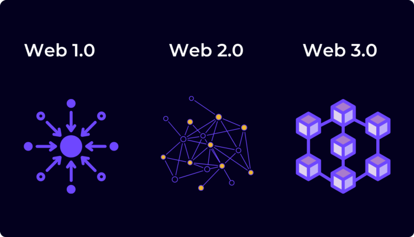

# A beginning journey in Web 3

## Understanding the ecosystem, starting from scratch

Read the article on [Medium](https://medium.com/@__initial__/a-beginning-journey-in-web3-79a0bc169cd).

From now on, I want to dig into the web3 environment and take you with me. This is extremely thrilling as having only scratched its surface, I can tell this fairly new ecosystem has a huge upside potential for the emergence of new ideas and for having fun! This is why I will try my best to walk you through my understanding of web3 with a series of articles. I’ll keep you informed with documentation such as links, tutorials, the stack I am using, etc so that you can eventually reproduce anything you want. This will also serve as a logbook for me.
Just to give you a little heads up, I am not starting from “nothing”. I am a master’s degree candidate in both applied mathematics and computer science. Therefore, I believe a bunch of technical points will be overlooked although I intend to avoid doing that. Also, I have pursued a 3 month long Defi project on the side, but it’s almost as if it is irrelevant: the purpose was to exploit a well-known vulnerability. However, the project was such a niche that I haven’t really learned anything about web3 besides extremally specific technicalities.
That project, along with regular exchanges with a friend, really led me to believe there are many great things to do in Web3 (I don’t know which one yet, the whole purpose is to find out as I walk you through my journey!). Keep in mind that while this article will be on the “surface”, I will write new ones that will get more and more specific.
Let’s get started!

---

**Accessing information**

The first thing to do is to access information, so you can read and interact with the environment. The idea is to slowly get acquainted with it. I would recommend creating a Twitter account, a lot of great people share gold information on a daily basis. I’ll try to do so within the next few months too. When you have time, just scroll on Twitter and read what’s going on. It might feel like you’re lost at the beginning but give it time. It’s gonna get clearer! Among many great accounts, I recommend the following two:

- @JessicaLawson92
- @milesdeutscher

There are many others obviously. You might also want to create a discord account, if you don’t already have one, and join the many public groups sharing web3 content.

### Understanding the basics

**What is Web 3 ?**

There’s an extraordinary google doc available [here](https://docs.google.com/document/d/1SWJw_NTyUvgdB_asRzsnVyKjciW8dZbeqQeUeWsEiQc/edit). I think it’s a great overall introduction, with a lot of sources to wrap your head around the several main concepts. Still, to quickly summarize what web3 I would say that once there was web1, with read-only pages, then there was web2 with which people could interact, with write-read pages. Stemming from web2 were the huge evil corporations such as Google, that centralize everything and pretty much own you since they own your data. Comes web3, which aims (and remember that because that’s the whole web3 moto) at taking over control of your own data, with write-read-own pages. The incentive lies within the usage of tokens (what the f**** are those?). It’s a numerical asset that can be exchanged on a blockchain. You’ll understand those concepts soon enough, don’t worry. I had to give it time too at first! Just so you know, there’s a glossary [here](https://coinmarketcap.com/alexandria/glossary) that you can refer to as much as you want.

Enough with the unintelligible definition: the way I see it, web3 is an innovation that gives control to its users. If you feel like doing something, nobody will be able to prevent you from doing it. Unless it’s not intuitively impossible like double-spending some money. The interesting thing is that hard-coded algorithms decide whether you can do something or not. It’s not up to someone else to say. It’s inherent to the system you are interacting with. There are a bunch of predefined rules that apply and what you do will be automatically reverted if you go against the rules, otherwise, you’ll achieve what you wanted. Now, this implies that users have control of their do’s. For instance, if you feel like exchanging a type of “money” for another one, for the amount you feel, there is no bank that can prevent you! There is only an algorithm, coded in what is called a smart contract, that will check that you have the money to do so, and that is available. It could also allow music artists to cashback as much money as possible when you’d listen to their song while, currently, Spotify compensates artists at an average rate of 0,0008$/listening.

It seems there are endless possibilities to develop, whether it’s a Dapp (Decentralized applications just like the one that could replace Spotify in web3 even though Spotify is trying to get a piece of the cake already) or a DAO, etc. You’ll come to that realization when reading more about the ecosystem!

### An overview of the ecosystem

Disclaimer: this is not my own work I present below. Many of the content, if not all, were already gathered in a single [doc](https://docs.google.com/document/d/1ObiFHmmZnWmX5alar-O81QwkAHFERKUFDDo2AcEDPZg/edit#heading=h.j0ae9beff73i) by the amazing Jessica Lawson. However, I tried my best to boil down the number of links while preserving the intelligibility of content.
The links are divided, as done by Jessica, into the several main categories that have emerged in web3 yet.

**Web3**

This one section only provides articles that could add things to what I just said. Giving it a different perspective also.

- An amazing [intro](https://docs.google.com/document/d/1SWJw_NTyUvgdB_asRzsnVyKjciW8dZbeqQeUeWsEiQc/edit) that says it all
- The [reasons](https://medium.com/fabric-ventures/what-is-web-3-0-why-it-matters-934eb07f3d2b) to get yourself interested in web3
- The Web3 [Landscape](chrome-extension://efaidnbmnnnibpcajpcglclefindmkaj/viewer.html?pdfurl=https%3A%2F%2Fa16z.com%2Fwp-content%2Fuploads%2F2021%2F10%2FThe-web3-Readlng-List.pdf&clen=1508959&chunk=true)

**Blockchain**

- What is a [blockchain](https://hackernoon.com/wtf-is-the-blockchain-1da89ba19348) ?
- The tech behind a [blockchain](https://www.gemini.com/cryptopedia/blockchain-technology-explained)

**Crypto**

- [Bitcoin](https://www.youtube.com/watch?v=bBC-nXj3Ng4)
- Bitcoin [whitepaper](chrome-extension://efaidnbmnnnibpcajpcglclefindmkaj/viewer.html?pdfurl=https%3A%2F%2Fbitcoin.org%2Fbitcoin.pdf&clen=184292&chunk=true)
- Ethereum [whitepaper](https://ethereum.org/en/whitepaper/)
- [Ethereum](https://www.youtube.com/watch?v=66SaEDzlmP4) in 25 min

**DeFi**

- Guide to [Defi](https://nakamoto.com/beginners-guide-to-defi/)
- [The Defiant’s guide](http://the%20defiant%27s%20definitive%20guide%20to%20defi/) (contains a lot of internal useful links)

**DAO**

- [What are DAOs](https://hackernoon.com/what-is-a-dao-c7e84aa1bd69)?
- [Everything about DAOs](https://foundation.app/blog/everything-you-need-to-know-about-daos)

**NFTs**

- A beginner’s [guide to NFT](https://linda.mirror.xyz/df649d61efb92c910464a4e74ae213c4cab150b9cbcc4b7fb6090fc77881a95d)
- [NFT 101](http://xn--nfts%20101%20%20why%20nfts%20are%20a%20generational%20innovation-s724b/)

---

### Environmental impact

I just wanted to finish that first article with this flaming subject and to reassure you. As you might know, “cryptos” are known to consume a tremendous amount of energy, which is an issue given the crisis regarding the topic. Originally, ways of ensuring the integrity of the ledger were based on PoW ([Proof of Work](https://ethereum.org/en/developers/docs/consensus-mechanisms/pow/)) which is increasingly heavy and requires energy-consuming computations. Nowadays there are new protocols that have stemmed to answer environmental preoccupations people had. For instance PoS or PoH. But I will leave that for another article.

--- 

Alright, that was it for the first article regarding Crypto ! Keep in mind that it will only get more complex. I believe that even though you already know each of these notions, my goal is to increasingly dig in each of the latter and provide a precise view on each and what I have done to interact with those. Next time. I’ll talk to you about the way I implemented a Python bot to track variation of the crypto market as a way of being automatically informed and getting to know web3 technical modules 🙃