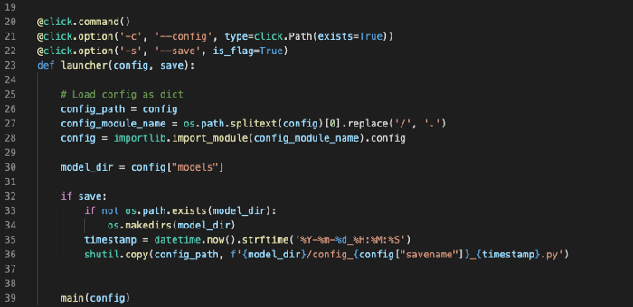
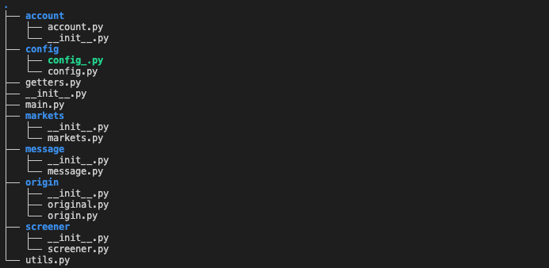
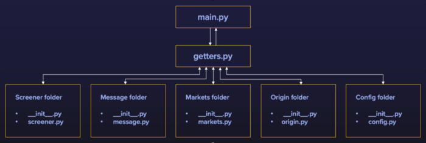

# Portfolio tracker bot and Automatic screening of cryptos

## A Python structure to follow crypto variations on major CEX/DEX. And more if you want it to be.

Read the article on [Medium](https://medium.com/p/4161f81ed603).

*Link to [Repo](https://github.com/thsgr/portfolio-crypto-tracker)*

Today I want to share a little work I did a few months ago that helped me keep track of several price variations for tokens I considered interesting. I had no crypto experience whatsoever prior to implementing this project. What I can now say, which is why I’ll share my code, is that it has definitely helped me understand the basics of price movements, correlated assets, and how the market reacts and fluctuates.

I used the CCXT to get access to prices. I chose it simply for its simplicity, built-in functions, and wide range of exchanges I could connect to with the same modules. CCXT lets users instantiate a connectorto reach out to exchange and have a permanent, stable connection. The functions are the same whether you want to connect to Binance, Bitsamp, etc. They added that layer on top of each exchange API which uniformizes methods.

---

**Find the code [here](https://github.com/thsgr/portfolio-crypto-tracker)**

The code is commented on and rather easy to go through. I restrict this short article to only explaining the architecture and its principle.

## Global Architecture
A few months ago, at the beginning of a research internship, a computer scientist introduced me to his favorite code structure and the spirit it comes with. It is very powerful because it lets you have enormous flexibility. It is object-oriented, so I advise anyone who doesn’t know the paradigm to get familiar with it! I have removed all personal functions and only left one function, which allows for being informed of your daily portfolio updates. That way you have can understand the code logic and implement your own functionalities!
Below you’ll see how the code is divided.

To give an overview: `main.py` is where the pieces are assembled. The getters.py lets you access the pieces. All the pieces are split up into sub-directories. That way, modules are well divided and their name speaks for themselves. Finally, a `config.py` the file aims at specifying every necessary configuration in the same place.

## The modules

There are 5 modules yet. Since the code is very flexible, anyone can add new ones that can very easily plug in the existing structure. All there is to do is create a get_function in the `getters.py` and call it in `main.py`. For instance, you can add an orders module that can send buy/sell orders to the market. My project aimed to be informative but if you feel like turning it into a trading bot, it can quickly be done.

- **Markets**: Essentially, what that module does is initiate a connector to the specified market in the `config.py` file. There are subclasses to each exchange in case you want specific functions for particular exchanges.
- **Screener**: This is the module that scraps data and computes what you want.
- **Message**: I chose to be informed through telegram. Therefore, this module allows to send me a specific message on triggering events. That way, I know for instance when AVAX increased by at least 5% within the last 24h.
- **Account**: As CCXT renders unreadable dict,JSON files, I created a Wallet class to clean this data, to access your net balance in the currency you want, etc.
- **Origin**: Not so much a module but rather a file to store both the tokens you have and at what price they were acquired. That way, you can stay informed, through the message module of your daily portfolios update for instance.

Finally, I didn’t mention it before but you need to store your private and public keys somewhere. And load it directly into the config.py file. I let you handle it the way you want to secure it by yourself.

Just to make it more clear, I did this little graph structure:

## Conclusion

Even though it is a little repo, I found the structure to be powerful because flexible and anyone can very easily add layers, new modules, etc. Please don’t hesitate to engage with the repo by creating issues, and pull requests. I appreciate any contribution 😊